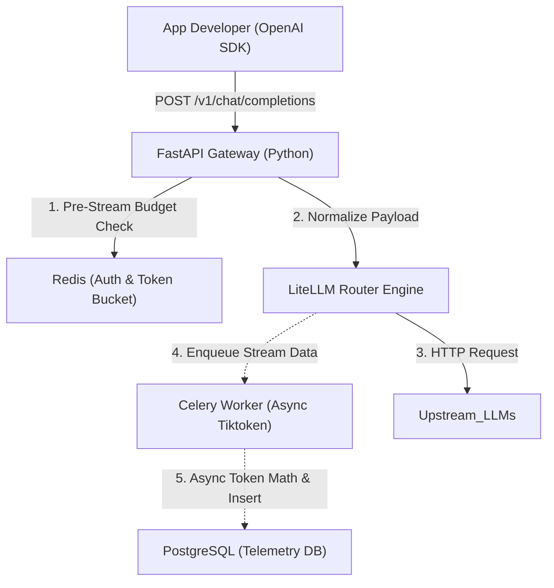

### System Architecture Overview
The system is designed for **high throughput and low latency**. The critical path (Developer -> Gateway -> LLM) is strictly separated from the observability path (Telemetry -> Database).

### Core Components
1. **FastAPI:** Handles thousands of concurrent I/O requests.
2. **Redis (Single Primary):** Low-latency layer for atomic Token Bucket rate-limiting.
3. **PostgreSQL:** Time-scale partitioned metadata logging.